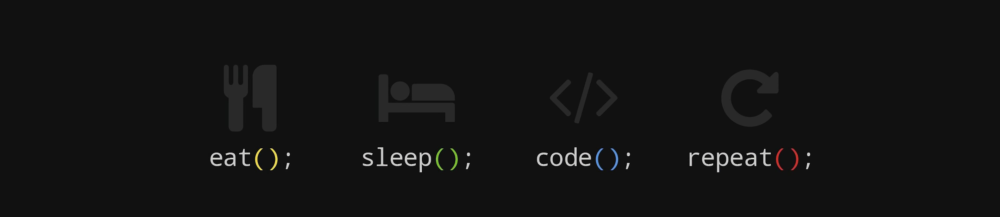

Hi 👋 My name is Divya
======================

A Passionate MERN Stack Developer
---------------------------------

I’m actively building dynamic, user-focused applications using the MERN stack (MongoDB, Express.js, React, and Node.js). I thrive on transforming ideas into reality by crafting seamless full-stack solutions, from intuitive front-end designs to robust back-end systems. With hands-on experience in solving complex problems and delivering high-quality code, I’m always eager to learn, grow, and collaborate on innovative projects. Let’s connect and create something amazing together! 🚀

* 🌍  I'm based in Vijayawada, AP
* 🖥️  See my portfolio at [divya.inapakurthi](http://divya6265.github.io/Divya-Inapakurthi/)
* ✉️  You can contact me at [divya.inapakurthi@gmail.com](mailto:divya.inapakurthi@gmail.com)
* 🚀  I'm currently working on [WEB SOCKETS](http://tic-tac-toe-web-socket-frontend.vercel.app/)

### Skills

### Socials

 <a href="https://www.codepen.io/divya-inapakurthi" target="_blank" rel="noreferrer"> <picture> <source media="(prefers-color-scheme: dark)" srcset="https://raw.githubusercontent.com/danielcranney/readme-generator/main/public/icons/socials/codepen-dark.svg" /> <source media="(prefers-color-scheme: light)" srcset="https://raw.githubusercontent.com/danielcranney/readme-generator/main/public/icons/socials/codepen.svg" />  </picture> </a> <a href="https://www.github.com/Divya6265" target="_blank" rel="noreferrer"> <picture> <source media="(prefers-color-scheme: dark)" srcset="https://raw.githubusercontent.com/danielcranney/readme-generator/main/public/icons/socials/github-dark.svg" /> <source media="(prefers-color-scheme: light)" srcset="https://raw.githubusercontent.com/danielcranney/readme-generator/main/public/icons/socials/github.svg" />  </picture> </a> <a href="http://www.instagram.com/divya.music_lvr" target="_blank" rel="noreferrer"> <picture> <source media="(prefers-color-scheme: dark)" srcset="https://raw.githubusercontent.com/danielcranney/readme-generator/main/public/icons/socials/instagram-dark.svg" /> <source media="(prefers-color-scheme: light)" srcset="https://raw.githubusercontent.com/danielcranney/readme-generator/main/public/icons/socials/instagram.svg" />  </picture> </a> <a href="https://www.stackoverflow.com/users/16548456/divya" target="_blank" rel="noreferrer"> <picture> <source media="(prefers-color-scheme: dark)" srcset="https://raw.githubusercontent.com/danielcranney/readme-generator/main/public/icons/socials/stackoverflow-dark.svg" /> <source media="(prefers-color-scheme: light)" srcset="https://raw.githubusercontent.com/danielcranney/readme-generator/main/public/icons/socials/stackoverflow.svg" />  </picture> </a>

### Badges

<b>My GitHub Stats</b>

<b>Top Repositories</b>

       
